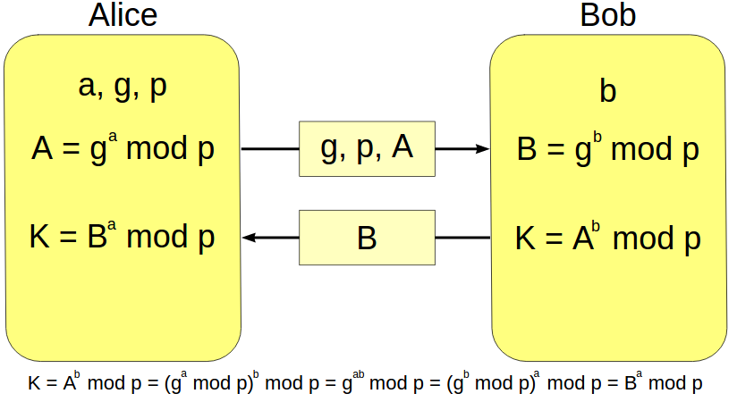

[TOC]

# 迪菲-赫尔曼密钥交换

## 概述

+ 迪菲-赫尔曼密钥交换（英语：Diffie–Hellman key exchange，缩写为D-H） 是一种安全协议。
+ 它可以让双方在完全没有对方任何预先信息的条件下**通过不安全信道（公共信道）**创建起一个密钥。
+ 这个密钥可以在后续的通讯中作为**对称密钥**来加密通讯内容。
+ 迪菲－赫尔曼密钥交换的同义词包括:
  - **迪菲－赫尔曼密钥协商**
  - **迪菲－赫尔曼密钥创建**
  - **指数密钥交换**
  - **迪菲－赫尔曼协议**
+ 虽然迪菲－赫尔曼密钥交换本身是一个匿名（无认证）的密钥交换协议，它却是很多认证协议的基础
+ 被用来提供**传输层安全**协议的短暂模式中的完备的前向安全性。

## 过程

迪菲－赫尔曼通过公共信道交换一个信息，就可以创建一个可以用于在公共信道上安全通信的共享秘密。

 

+ 最简单，最早提出的这个协议使用一个素数*p*的整数模n乘法群以及其[原根](https://zh.wikipedia.org/wiki/%E5%8E%9F%E6%A0%B9)*g*。
+ 下面展示这个算法， **粗体**表示秘密信息：

1. Alice与Bob协定使用 *p*=23以及base *g*=5.

2. Alice选择一个秘密整数**a=6**, 计算$A = g^a \  mod \ p$并发送给Bob。A = 8.

3. Bob选择一个秘密整数**b=15**, 计算$B = g^b \ mod  \ p$并发送给Alice。B = 19.

4. Alice计算 **s**  $ = B^a \ mod \ p$

   $19^6 \ mod \ 23$ = **2**

5. Bob计算 **s**  $ = B^a \ mod \ p$

   $8^{15} \ mod \ 23 $ =  **2**

6. Alice和Bob最终都得到了同样的值**2**

以下是一个更为一般的描述:

1. 爱丽丝和鲍伯写上一个有限循环群 *G* 和它的一个生成元 *g*。 （ *g*是公开的，并可以被所有的攻击者看到。）
2. 爱丽丝选择一个随机自然数 *a* 并且将${\displaystyle g^{a}{\bmod {p}}}$发送给鲍伯。
3. 鲍伯选择一个随机自然数 *b* 并且将${\displaystyle g^{b}{\bmod {p}}}$发送给爱丽丝。
4. 爱丽丝 计算${\displaystyle \left(g^{b}\right)^{a}{\bmod {p}}}$。
5. 鲍伯 计算${\displaystyle \left(g^{a}\right)^{b}{\bmod {p}}}$。

## 安全性

1. 对爱丽丝来说解开鲍伯的私钥或鲍伯要解开爱丽丝的私钥应该都很困难
2. 在选择了合适的*G*和*g*时 这个协议被认为是窃听安全的
3. 秘密的整数*a*和*b*在会话结束后会被丢弃。因此，迪菲－赫尔曼密钥交换本身能够天然地达到**完备的前向安全性**，因为私钥不会存在一个过长的时间而增加泄密的危险
4. 在最初的描述中，迪菲－赫尔曼密钥交换本身并没有提供通讯双方的身份验证服务，因此它很容易受到[中间人攻击](https://zh.wikipedia.org/wiki/%E4%B8%AD%E9%97%B4%E4%BA%BA%E6%94%BB%E5%87%BB)。 一个中间人在信道的中央进行两次迪菲－赫尔曼密钥交换，一次和Alice另一次和Bob，就能够成功的向Alice假装自己是Bob，反之亦然。而攻击者可以解密（读取和存储）任何一个人的信息并重新加密信息，然后传递给另一个人。因此通常都需要一个能够验证通讯双方身份的机制来防止这类攻击。