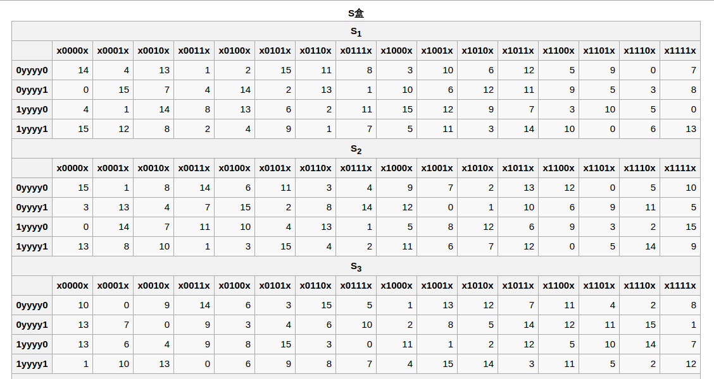
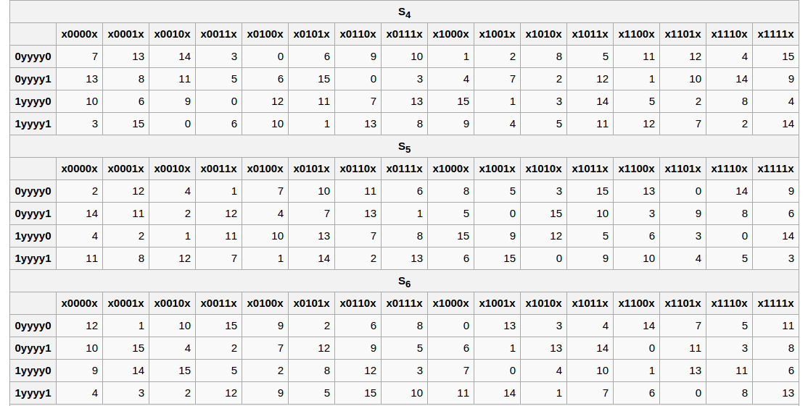
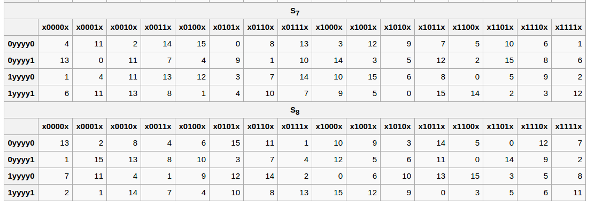

[TOC]

# DES补充材料

本文档中的数据都是以大端序排列的，也即首位为MSB。

## 初始置换(IP)

|  58  |  50  |  42  |  34  |  26  |  18  |  10  |  2   |
| :--: | :--: | :--: | :--: | :--: | :--: | :--: | :--: |
|  60  |  52  |  44  |  36  |  28  |  20  |  12  |  4   |
|  62  |  54  |  46  |  38  |  30  |  22  |  14  |  6   |
|  64  |  56  |  48  |  40  |  32  |  24  |  16  |  8   |
|  57  |  49  |  41  |  33  |  25  |  17  |  9   |  1   |
|  59  |  51  |  43  |  35  |  27  |  19  |  11  |  3   |
|  61  |  53  |  45  |  37  |  29  |  21  |  13  |  5   |
|  63  |  55  |  47  |  39  |  31  |  23  |  15  |  7   |

该表显示了对64位块的初始置换，其意义如下：输出的首位为输入的第58位，第二位为50位，依此类推，输出的最后位为输入的第7位。

以上信息为了方便表示被写成表格形式，但它实际上是一个矢量（一维的就足够表示了），而非矩阵。

## 最终置换 (IP-1)

|  40  |  8   |  48  |  16  |  56  |  24  |  64  |  32  |
| :--: | :--: | :--: | :--: | :--: | :--: | :--: | :--: |
|  39  |  7   |  47  |  15  |  55  |  23  |  63  |  31  |
|  38  |  6   |  46  |  14  |  54  |  22  |  62  |  30  |
|  37  |  5   |  45  |  13  |  53  |  21  |  61  |  29  |
|  36  |  4   |  44  |  12  |  52  |  20  |  60  |  28  |
|  35  |  3   |  43  |  11  |  51  |  19  |  59  |  27  |
|  34  |  2   |  42  |  10  |  50  |  18  |  58  |  26  |
|  33  |  1   |  41  |  9   |  49  |  17  |  57  |  25  |

IP-1（亦被称为FP）是IP的逆过程，上表的含义与IP的相似。

## 扩张函数 (E函数)

|  32  |  1   |  2   |  3   |  4   |  5   |
| :--: | :--: | :--: | :--: | :--: | :--: |
|  4   |  5   |  6   |  7   |  8   |  9   |
|  8   |  9   |  10  |  11  |  12  |  13  |
|  12  |  13  |  14  |  15  |  16  |  17  |
|  16  |  17  |  18  |  19  |  20  |  21  |
|  20  |  21  |  22  |  23  |  24  |  25  |
|  24  |  25  |  26  |  27  |  28  |  29  |
|  28  |  29  |  30  |  31  |  32  |  1   |

扩张函数被作为最初和最终的置换。输入中的**某些位在输出中被用到了不止一次**，因此32位的半块输入被**扩张**到了48位。

## P置换

|  16  |  7   |  20  |  21  |
| :--: | :--: | :--: | :--: |
|  29  |  12  |  28  |  17  |
|  1   |  15  |  23  |  26  |
|  5   |  18  |  31  |  10  |
|  2   |  8   |  24  |  14  |
|  32  |  27  |  3   |  9   |
|  19  |  13  |  30  |  6   |
|  22  |  11  |  4   |  25  |

P置换将32位的半块数据重新排列。

## 选择置换1(PC-1)

|  左   |      |      |      |      |      |      |
| :--: | :--: | :--: | :--: | :--: | :--: | :--: |
|  57  |  49  |  41  |  33  |  25  |  17  |  9   |
|  1   |  58  |  50  |  42  |  34  |  26  |  18  |
|  10  |  2   |  59  |  51  |  43  |  35  |  27  |
|  19  |  11  |  3   |  60  |  52  |  44  |  36  |
|  右   |      |      |      |      |      |      |
|  63  |  55  |  47  |  39  |  31  |  23  |  15  |
|  7   |  62  |  54  |  46  |  38  |  30  |  22  |
|  14  |  6   |  61  |  53  |  45  |  37  |  29  |
|  21  |  13  |  5   |  28  |  20  |  12  |  4   |

上表的“左”和“右”两部分表现了输入密钥组成密钥调度状态中左右两部分的过程。主要输入的64位数据中只用到了56位，剩余的8位可以用于奇偶校验。

## 选择置换2(PC-2)

|  14  |  17  |  11  |  24  |  1   |  5   |
| :--: | :--: | :--: | :--: | :--: | :--: |
|  3   |  28  |  15  |  6   |  21  |  10  |
|  23  |  19  |  12  |  4   |  26  |  8   |
|  16  |  7   |  27  |  20  |  13  |  2   |
|  41  |  52  |  31  |  37  |  47  |  55  |
|  30  |  40  |  51  |  45  |  33  |  48  |
|  44  |  49  |  39  |  56  |  34  |  53  |
|  46  |  42  |  50  |  36  |  29  |  32  |

该置换从56位的密钥调度状态中取出48位的子密钥。

## 置换盒 (S盒)

 

上表列出了DES中使用的8个S盒。每个S盒将6位输入变为4位输出。给定输入后，输出行由外侧两位确定，列由内侧的4位确定，例如“**0**1101**1**”的输入的外侧位为“**01**”，内侧位为“1101”，而每张表的第一行为“00”，第一列为“0000”因此在S5中的对应输出为“1001”（十进制的9），即第2行，第14列

## 密钥调度过程中的移位

| 回次   | 左移位数 |
| ---- | ---- |
| 1    | 1    |
| 2    | 1    |
| 3    | 2    |
| 4    | 2    |
| 5    | 2    |
| 6    | 2    |
| 7    | 2    |
| 8    | 2    |
| 9    | 1    |
| 10   | 2    |
| 11   | 2    |
| 12   | 2    |
| 13   | 2    |
| 14   | 2    |
| 15   | 2    |
| 16   | 1    |

在子密钥生成完成前，密钥调度状态的每个半块都要向左循环移动特定的位，上表显示了移位的数量。