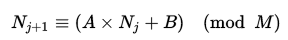

[TOC]

# 流加密

## 术语

+ TRNG     真随机数发生器
+ PRNG     伪随机数发生器
+ PRF         伪随机函数
+ RC4         一种流加密算法

## 概述

在密码学中，**流加密**，是一种对称加密算法，加密和解密双方使用**相同伪随机加密数据流**作为密钥，明文数据每次与密钥数据流顺次对应加密，得到密文数据流。实践中数据通常是一个位并用异或（xor）操作加密。

该算法解决了对称加密[完善保密性](https://zh.wikipedia.org/wiki/%E5%AE%8C%E5%96%84%E4%BF%9D%E5%AF%86%E6%80%A7)的实际操作困难。由于完善保密性要求密钥长度不短于明文长度，故而实际操作存在困难，改由较短数据流通过特定算法得到密钥流。

## 流加密的实现——RC4算法

### 伪代码

初始化长度为256的[S盒](https://zh.wikipedia.org/wiki/S%E7%9B%92)。第一个for循环将0到255的互不重复的元素装入S盒。第二个for循环根据密钥打乱S盒。

```java
 for i from 0 to 255
     S[i] := i
 endfor
 j := 0
 for( i=0 ; i<256 ; i++)
     j := (j + S[i] + key[i mod keylength]) % 256
     swap values of S[i] and S[j]
 endfor
```

下面i,j是两个指针。每收到一个字节，就进行while循环。通过一定的算法（(a),(b)）定位S盒中的一个元素，并与输入字节异或，得到k。循环中还改变了S盒（(c)）。如果输入的是[明文](https://zh.wikipedia.org/wiki/%E6%98%8E%E6%96%87)，输出的就是[密文](https://zh.wikipedia.org/wiki/%E5%AF%86%E6%96%87)；如果输入的是密文，输出的就是明文。

```java
 i := 0
 j := 0
 while GeneratingOutput:
     i := (i + 1) mod 256   //a
     j := (j + S[i]) mod 256 //b
     swap values of S[i] and S[j]  //c
     k := inputByte ^ S[(S[i] + S[j]) % 256]
     output K
 endwhile
```

此算法保证每256次循环中S盒的每个元素至少被交换过一次。

## 流加密攻击常见错误

### 多次使用同一密码本

一种严重的错误即反复使用同一密码本对不同明文进行加密。攻击者可利用这种方式对密文进行解密。

用m表示明文，c表示密文，k表示种子，PRG表示密钥流生成算法，则：

- C1 = m1 xor PRG (k)
- C2 = m2 xor PRG (k)

攻击者监听到此段消息（包含两段相同密钥流加密的密文）后，即可利用：

- C1 xor C2得到 m1 xor m2

足量的[冗余](https://zh.wikipedia.org/w/index.php?title=%E5%86%97%E4%BD%99&action=edit&redlink=1)（此处表示m1，m2）则可破解明文。

一个失败的例子即[WEP](https://zh.wikipedia.org/wiki/WEP)网络传输协议。

## 相关概念：线性同余发生器

### 概念

**线性同余方法**（**LCG**）是个产生伪随机数的方法。

它根据以下公式来产生一个随机数流

 

LCG的周期最大为，但大部分情况都会少于M。要令LCG达到最大周期，应符合以下条件：

1. [互质](https://zh.wikipedia.org/wiki/%E4%BA%92%E8%B3%AA)；
2. 的所有质因数都能整除；
3. 若是4的[倍数](https://zh.wikipedia.org/wiki/%E5%80%8D%E6%95%B8)，也是；
4. 都比小；
5. 是正整数。

### 应该避免使用于密码

因为通过线性同余方法构建的伪随机数生成器的内部状态可以轻易地由其输出演算得知，所以此种伪随机数生成器属于统计学伪随机数生成器。

设计密码学的应用必须至少使用[密码学安全伪随机数生成器](https://zh.wikipedia.org/wiki/%E5%AF%86%E7%A0%81%E5%AD%A6%E5%AE%89%E5%85%A8%E4%BC%AA%E9%9A%8F%E6%9C%BA%E6%95%B0%E7%94%9F%E6%88%90%E5%99%A8)，即还需满足“不能通过给定的随机序列的一部分而以显著大于“的概率，故需要避免由线性同余方法获得的随机数在密码学中的应用。

## 相关概念：一次性密码本

### 概述

**一次性密码本**（**one-time pad**，缩写为**OTP**）是古典密码学中的一种加密算法。是以随机的密钥（key）组成明文，且只使用一次。

### 安全性

一次一密是完备安全的，但是必须保证真随机性。因此有实现上的困难。

## 相关概念：BBS发生器

### 算法

BBS：Blum与Shub发明了最简单有效的伪随机发生器，称为 Blum ，Blum 和Shub发生器，简称为BBS，有时也称二次剩余发生器[4]，BBS发生器的理论是必须做模n的二次剩余，其工作原理是：首先找两个大素数p和q，它们满足模n的二次剩余。

即要求： p ≡ q ≡ 3 (mod 4)

然后用一系列算法递归产生下一位

### 安全性

BBS是密码学安全伪随机数发生器。